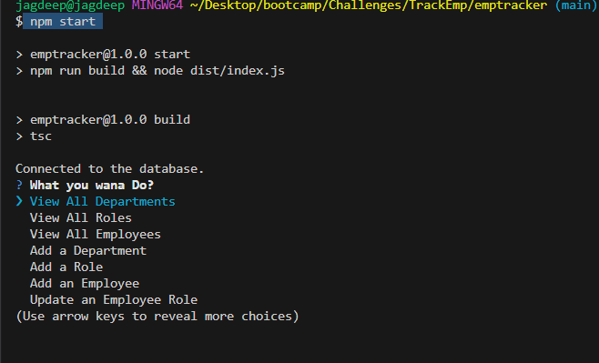

# TrackEmp
## Description
- AS A business owner
- I WANT to be able to view and manage the departments, roles, and employees in my company
- SO THAT I can organize and plan my business
## Usage
- To Use this `Employee Tracker` App Pls copy Repo `TrackEmp` and paste in your Machine.
- Make Database and tables according to sql files inside folder `database/schema.sql` and seed the database with query Commands in `seed.sql`.
- After configuring the Database, Run command `npm i` then  `npm start or npm run start` in your command line interface inside directry name `TrackEmp/emptracker`.
- Then I am presented with the following options: view all departments, view all roles, view all employees, add a department, add a role, add an employee, and update an employee role as Prompt in Cli.
     
     
    
- WHEN I choose to view all departments
- THEN I am presented with a formatted table showing department names and department ids.
- WHEN I choose to view all roles.
- THEN I am presented with the job title, role id, the department that role belongs to, and the salary for that role.
- WHEN I choose to view all employees.
- THEN I am presented with a formatted table showing employee data, including employee ids, first names, last names, job titles, departments, salaries, and managers that the employees report to.
- WHEN I choose to add a department
- THEN I am prompted to enter the name of the department and that department is added to the database.
- WHEN I choose to add a role
- THEN I am prompted to enter the name, salary, and department for the role and that role is added to the database
- WHEN I choose to add an employee
- THEN I am prompted to enter the employee's first name, last name, role, and manager, and that employee is added to the database.
- WHEN I choose to update an employee role
- THEN I am prompted to select an employee to update and their new role and this information is updated in the database.
- Please Don't forget to see the `Walk through video`. See The Link in `Question` Section.
## license 
- 
## Questions 
- 
- 
- :https://drive.google.com/file/d/1aGNdtIdStMatQxVhGUzn_tQ0G8-5tsmF/view

